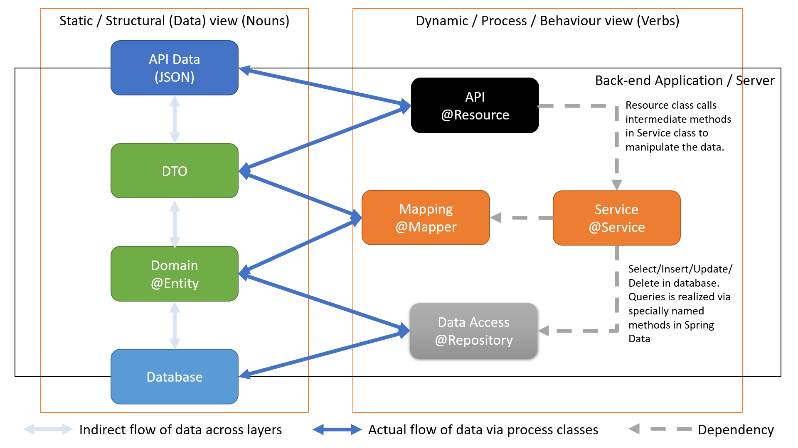
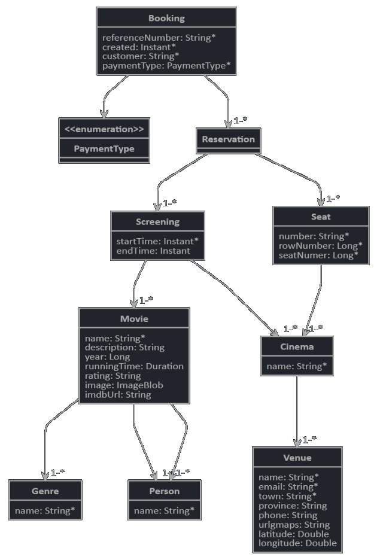

= Java Exercise 6

In this excercise we start with a new, more complex project. It is a Spring Boot Web Service application using Spring Web, Spring Data, JPA and Hibernate.

We introduce MapStruct to convert from Entity classes to DTO classes.

== Running the server

Run the server in any one of the ways listed below. Once the application is started it will keep running until Ctrl-C is pressed.

=== Maven

[source, shell]
mvn spring-boot:run

=== Java on the command line

From the command line, after running the Maven `install` command;

[source, shell]
mvn install

Then run the jar file, in the target directory, directly.

[source, shell]
java -jar target\java-exercise-6-1.0.0-SNAPSHOT.jar

=== From Eclise / STS

Right-click the application class and select Run As -> Spring Boot Application.

NOTE: Due to a wrong configuration in the POM.XML file you need to first run `mvn install` on the command line at least once before running from the IDE.

== Architecture

=== Tiers

This application is (currently still) a 2 tier application, consisting out of;

* Back-end / Application layer
* Database layer

NOTE: The front-end layer will be added later in the training course.

Currently the H2 database is embedded inside the application, which is done to reduce complexity. The application is however able to scale with no code changes to connect to a dedicated database server.

=== Views

Any application can typically be broken down into code which forms the static structures, like database tables, value objects, etc. and code performing behavioural functions, like services and processes.

When designing software systems the documentation is often divided into;

* Static views
* Dynamic / Behavioural views
* Component views
* Deployment views

TIP: The aforementioned views therefore makes up the first two views of the documentation.

=== Layers

At the most detail architectural level our Java application can then be broken down into the following layers;

.Architectural layers

.Architectural layers
[width="100%",options="header", cols="1,1,5"]
|====================
| Layer | Package | Description 
| API | .web.rest | `@Resource` classes to realise the RESTful APIs.
| DTOs | .service.dto | The `Data Transfer Objects` (DTOs) which will be (de-)serialized to/(from) JSON. These are https://en.wikipedia.org/wiki/Plain_old_Java_object[Plain Java Objects (POJOs)].
| Service | .service | `@Service` classes containing the business functions and processes.  
| Mapping | .service.mapper | `@Mapper` mapping interfaces (sometimes classes) to convert to/from `Entity` and `DTO` classes.
| Domain | .domain | `@Entity` JPA classes representing the database tables (usually exactly).
| Data Access | .repository | `@Repository` https://docs.spring.io/spring-data/jpa/docs/current/reference/html/#reference[Spring Data] interfaces, supporting the https://en.wikipedia.org/wiki/Create,_read,_update_and_delete[CRUD] functions and containing the query methods. 
|====================

== Model / Entity Relationship Diagram

The application represents a Movie Management application, which are used by company to list movies available to air, schedule the movies in cinemas, track the seats in each cinema and manage the booking process, which includes reserving seats.

.Entity Relationship Diagram of the application

== Rest enpoints

There are various APIs defined in this project. Here are examples of some of the GET operations;

[source, shell]
curl localhost:8080/api/movies
curl localhost:8080/api/genres
curl localhost:8080/api/people

The full API documentation, using SwaggerDoc, will be added later.